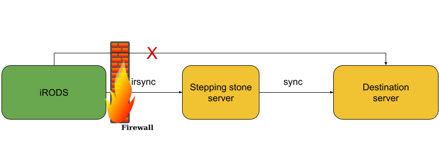

[](https://zenodo.org/badge/latestdoi/602078408)
# iBridges-SteppingStone
The scripts in this repository are developed for transferring data from Yoda/iRODS to a destination server through a stepping stone server in the middle.

## Use case
This method can be used when an iRODS instance is protected by a firewall (e.g. in the case of sensitive data) and the firewall is configured in such a way that data cannot be transferred directly between the iRODS server and the compute site (destination server).

When a stepping stone server is available, data tranfer can be organized in two steps:
1. `irsync` for data transfer between iRODS and the stepping stone server 
2. `rsync` for data transfer between the stepping stone server and the final destination, e.g. the compute server or VM (see below).



## Requirements
1. This method requires a stepping stone server to be setup at the periphery of the network (not covered in this repository). This server should be able to connect to iRODS and also to the compute facility.  
2. Both servers, stepping stone and destination server, are *linux* servers.  
3. The user that transfers data between the stepping stone server and the destination server authenticates for the destination server through an ssh-key pair.  
4. The iRODS `icommands` are installed on the stepping stone server ([instructions](https://www.uu.nl/en/research/yoda/guide-to-yoda/i-am-using-yoda/using-icommands-for-large-datasets)).
5. Python and the python-irodsclient are installed on the stepping stone server:
	- Python 3.X
	- python-irodsclient version 1.X

**The scripts are tested on Ubuntu with python 3.6.9.**

## Installation & configuration

The tools in this repo are installed and used on the stepping stone server.

1. Clone this GitHub repository  

`git clone https://github.com/UtrechtUniversity/iBridges-SteppingStone.git`

2. Create an iRODS configuration file:  
`touch ~/.irods/irods_environment.json`

3. Add all relevant info to the configuration file.  
`nano ~/.irods/irods_environment.json`
For Yoda users @UtrechtUniversity, find the relevant info [here](https://www.uu.nl/en/research/yoda/guide-to-yoda/i-am-using-yoda/using-icommands-for-large-datasets).

4. Install Python dependencies  
`pip3 install python-irodsclient==1.1.6`

5. Create a client configuration file. The client needs to be given the information about the destination server to copy data to and which user to use for the actions.  
`touch ~/.irods/transfer.config`

6. Add the relevant info to the client configuration file.  
`nano ~/.irods/transfer.config` 
```sh
[remote]
    serverip: IP address of destination server or FQDN
    datauser: user
    sudo: False

[local_cache]
    limit = number of GB of free space on stepping stone server (e.g. limit = 10)
```

## Usage
```
Usage: python3 transfer_workflow.py -i, --input=csv-file-path
Example: python3 transfer_workflow.py -i /home/user/transfer.csv
```
	
